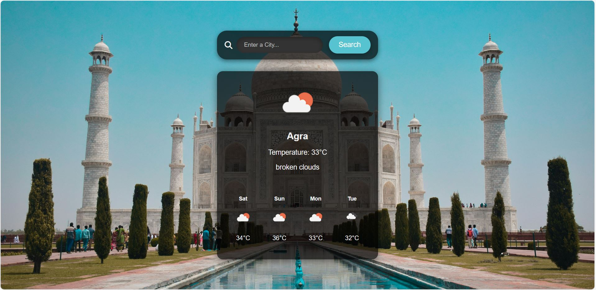

## <h1>Weather App</h1>

EasyWeather is a lightweight weather application crafted with HTML, CSS, and JavaScript, designed to provide users with quick and straightforward access to current weather conditions. Leveraging the power of APIs, the app seamlessly fetches real-time weather and geolocation information, ensuring users stay informed about their local weather with ease.

## Used Technologies
<ul>
  <li>HTML5</li>
  <li>CSS3</li>
  <li>JavaScript</li>
</ul>

## Used APIs
<ul>
  <li>Open Weather API: Fetches real-time weather data.</li>
 <li>Unsplash API:  Provides dynamic background images.</li>
</ul>

## ScreenShots 

## Contact

- **Email**: tathagatadas@gmail.com
- **LinkedIn**: (https://www.linkedin.com/in/tathagata-das94/)

Feel free to reach out if you have any questions or just want to connect!

